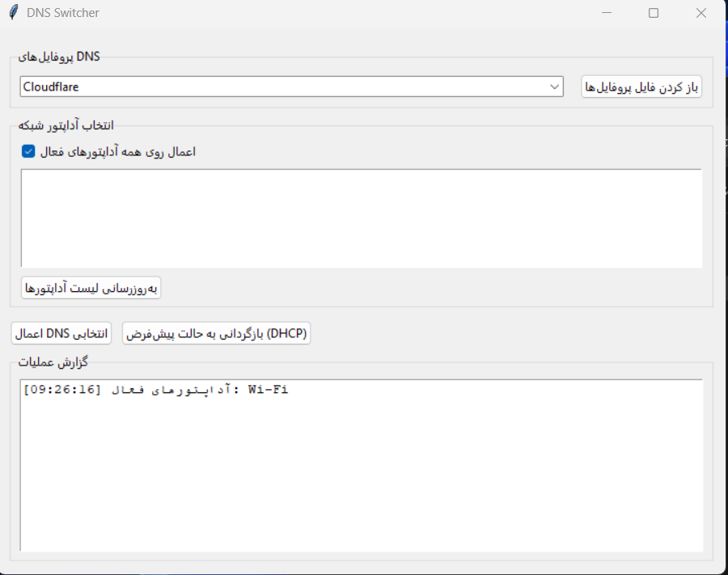

<p align="right">
  <a href="README.fa.md">🇮🇷 فارسی</a>
</p>
# DNS Switcher (Windows) – Portable Tkinter App


A lightweight, portable GUI app (Tkinter) to quickly switch DNS servers on Windows. Choose from built‑in profiles (Cloudflare, Google, Quad9, OpenDNS) or add your own via a local `dns_profiles.json`. Apply to all active network adapters or selected ones, and revert to default (DHCP) with one click.

> Requires Administrator privileges to apply changes.

---

## 📦 Features
- Multiple DNS profiles (IPv4/IPv6) — configurable via `dns_profiles.json`
- Apply to **all** active adapters or specific selected adapters
- **Revert to default (DHCP)** button
- Works without extra dependencies (PowerShell + netsh)
- Portable build with PyInstaller (`--onefile`) — copy & run
- UAC elevation flow built‑in (asks only when needed)

---

## 🚀 Quick Start
1. **Download** the latest release from the Releases page *(or build locally; see below)*.
2. *(Optional)* Place a custom `dns_profiles.json` next to the `.exe`.
3. Run the app. If not elevated, it can re‑launch with admin on demand.

> **Tip:** After switching DNS, you may want to flush DNS cache:
```bat
ipconfig /flushdns
```

---

## 🛠 Build from Source (Windows)
```powershell
# (optional) create & activate venv
py -m venv .venv
.\.venv\Scripts\Activate.ps1
python -m pip install --upgrade pip

# build portable exe
pip install pyinstaller
py -m PyInstaller --noconsole --onefile dns_switcher.py
# output: dist/dns_switcher.exe

# (optional) always prompt for admin at start
# py -m PyInstaller --noconsole --onefile --uac-admin dns_switcher.py
```

---

## 📁 Repository Structure
```
.
├─ dns_switcher.py              # main app (Tkinter GUI)
├─ README.md                    # this file
├─ LICENSE                      # MIT (see below)
├─ dns_profiles.json            # (optional) your custom profiles
└─ .github/
   └─ workflows/
      └─ build.yml             # GitHub Actions (Windows build + artifacts)
```

---

## ⚙️ `dns_profiles.json` (optional)
Create this file next to the `.exe` or `dns_switcher.py` to add/override profiles:
```json
{
  "MyOffice": {
    "ipv4": ["10.0.0.53", "10.0.0.54"],
    "ipv6": []
  },
  "Shecan": {
    "ipv4": ["178.22.122.100", "185.51.200.2"],
    "ipv6": []
  }
}
```
- Keys are profile names shown in the UI
- Both `ipv4` and `ipv6` arrays are optional; you can provide one or both
- User-defined profiles override built-ins with the same name

---

## 🔐 Permissions & Notes
- Applying DNS requires **Administrator** privileges
- On enterprise machines, **Group Policy** may block or revert changes
- App uses only **local PowerShell** cmdlets and `netsh` to configure DNS
- IPv6 fallback via `netsh` isn’t leveraged (PowerShell handles both families)

---

## ❓ Troubleshooting
- **Elevation errors:** Re-run as Administrator or click the in-app button to re-launch with admin
- **No adapters listed:** Ensure network adapters are *Up* and not virtual-only; click **Refresh**
- **Changes don’t stick:** A company GPO, VPN client, or security suite might override DNS
- **Flush after change:** `ipconfig /flushdns`

---

## 🤝 Contributing
PRs welcome! For larger changes, please open an issue to discuss.

- Keep UI simple and dependency‑free
- Consider adding unit‑testable helpers for adapter parsing and command generation

---

## 📝 License
Released under the MIT License. See `LICENSE`.

---

## 🖼️ Screenshot


